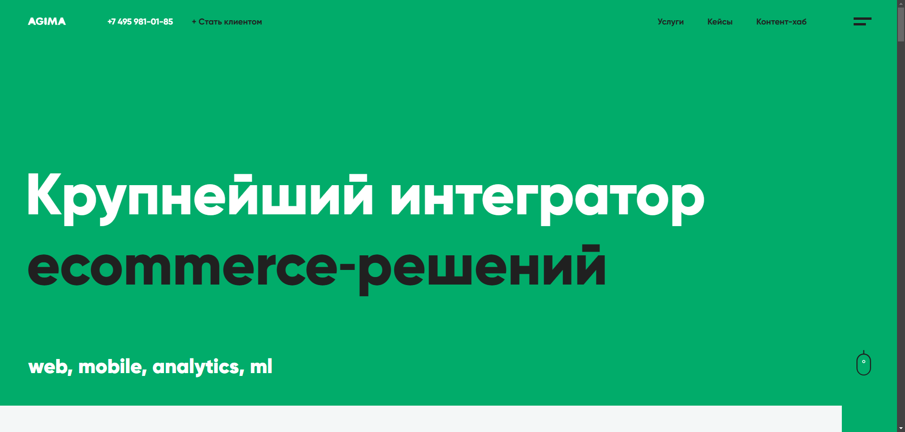
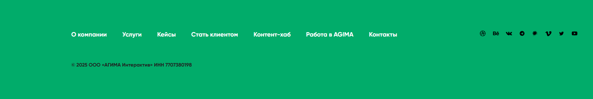

# АНАЛИЗ СОВРЕМЕННЫХ САЙТОВ
## ЛАБОРАТОРНАЯ РАБОТА №10 по дисциплине «Веб-технологии»
**Выполнил**: Студент группы 241-671 Закс Д. А.

### 1. Анализ сайтов и свойств
#### 1.1 Подборка сайтов

1. [Chipsa](https://chipsa.ru/) – веб-студия, специализирующаяся на разработке и создании сайтов, поисковом продвижении и привлечении трафика, а также поддержке и управлении проектами.
1. [Red Collar](https://redcollar.ru/) – цифровое агентство, занимающееся созданием веб-сайтов, мобильных приложений и брендинга.
1. [Oxem Studio](https://oxem.ru/) – студия веб-дизайна и разработки, предлагающая услуги по созданию сайтов и цифровых продуктов.
1. [WeMakeFab](https://wemakefab.ru/) – агентство, специализирующееся на разработке веб-сайтов и цифровых решений.
1. [Liqium](https://www.liqium.ru/) – компания, предоставляющая услуги по разработке и поддержке веб-проектов.
1. [Alto Codes](https://alto.codes/) – студия, занимающаяся разработкой веб-сайтов и приложений.
1. [AGIMA](https://www.agima.ru/) – крупнейший интегратор digital-решений, специализирующийся на создании интернет-магазинов, мобильных приложений для e-commerce и программ лояльности.
1. [ADV/web-engineering co.](https://adv.ru/) – компания, занимающаяся разработкой и созданием сайтов, поисковым продвижением, привлечением трафика, поддержкой и управлением проектами.
1. [IdaProject](https://idaproject.com/) – PropTech разработчик №1 в РФ, работающий с крупнейшими компаниями в сфере недвижимости, предоставляющий цифровые решения для девелоперов.
1. [Perx](https://perx.ru/) – цифровой партнер для автомобильного бизнеса, специализирующийся на создании уникальных цифровых продуктов для производителей автомобилей и дилерских сетей.

#### 1.2 Свойства

| №  | Синтаксис                   | Значения                                                                 | Прочая информация                                                                 | Назначение                                                                                   | Ссылка                        |
|----|-----------------------------|--------------------------------------------------------------------------|-----------------------------------------------------------------------------------|----------------------------------------------------------------------------------------------|-------------------------------|
| 1  | `scroll-behavior: smooth;`  | `auto`, `smooth`                                                         | Определяет, будет ли прокрутка элемента плавной или мгновенной.                    | Обеспечивает плавную прокрутку при навигации по якорным ссылкам.                              | [Chipsa](https://chipsa.ru/)  |
| 2  | `mix-blend-mode: multiply;` | `normal`, `multiply`, `screen`, `overlay`, `darken`, `lighten` и другие. | Определяет, как содержимое элемента должно смешиваться с фоном.                    | Создает эффект наложения цветов, похожий на умножение слоев в графических редакторах.         | [Red Collar](https://redcollar.ru/) |
| 3  | `clip-path: circle(50%);`   | Функции: `circle()`, `ellipse()`, `polygon()`, `inset()`                 | Определяет область отображения части элемента, обрезая остальную часть.            | Создает круглую область видимости для элемента, обрезая его по кругу.                        | [Oxem Studio](https://oxem.ru/) |
| 4  | `filter: grayscale(100%);`  | Функции: `blur()`, `brightness()`, `contrast()`, `grayscale()` и другие. | Применяет графические эффекты, такие как размытие или изменение цветовой гаммы.    | Преобразует изображение или элемент в оттенки серого.                                        | [WeMakeFab](https://wemakefab.ru/) |
| 5  | `object-fit: cover;`        | `fill`, `contain`, `cover`, `none`, `scale-down`                        | Определяет, как содержимое заменяемого элемента должно вписываться в контейнер.    | Обеспечивает обрезку изображения, чтобы оно полностью покрывало контейнер без искажений.      | [Liqium](https://www.liqium.ru/) |
| 6  | `backdrop-filter: blur(5px);` | Функции: `blur()`, `brightness()`, `contrast()`, `grayscale()` и другие. | Применяет графические эффекты к области позади элемента.                           | Создает эффект размытия фона позади элемента, подобно эффекту размытия в графических редакторах. | [Alto Codes](https://alto.codes/) |
| 7  | `scroll-snap-type: y mandatory;` | `none`, `x`, `y`, `block`, `inline`, `both` и дополнительные значения. | Определяет поведение привязки прокрутки для контейнера.                            | Обеспечивает привязку прокрутки к определенным точкам, создавая эффект "прилепания" к разделам. | [AGIMA](https://www.agima.ru/) |
| 8  | `writing-mode: vertical-rl;` | `horizontal-tb`, `vertical-rl`, `vertical-lr`                           | Определяет направление и ориентацию текста в блоке.                                | Поворачивает текст вертикально, с направлением письма справа налево.                          | [ADV/web-engineering co.](https://adv.ru/) |
| 9  | `shape-outside: circle(50%);` | Функции: `circle()`, `ellipse()`, `polygon()`, `inset()`                 | Определяет форму, вокруг которой будет обтекать текст.                             | Задает круглую область, вокруг которой текст будет обтекать элемент.                          | [IdaProject](https://idaproject.com/) |
| 10 | `aspect-ratio: 16 / 9;`     | Любое положительное число или отношение, например, `1`, `16/9`, `4/3`.   | Определяет соотношение сторон для элемента.                                        | Устанавливает соотношение сторон элемента, обеспечивая его правильное масштабирование.         | [Perx](https://perx.ru/)      |

### 2. Структура сайта

#### 2.1 Структура сайта [AGIMA](https://www.agima.ru/):



1. **Шапка (header):**
   - Содержит логотип, основное меню навигации и контактную информацию.
   - Основные элементы:
     - `<header class="header">`
       - `<div class="header__logo">` – логотип компании.
       - `<nav class="header__nav">` – основное меню.
         - `<ul class="nav__list">`
           - `<li class="nav__item">` – пункты меню.
       - `<div class="header__contacts">` – контактная информация.

1. **Основная часть (main):**
   - Включает в себя разделы с информацией о компании, услугах, проектах и новостях.
   - Основные элементы:
     - `<main class="main-content">`
       - `<section class="about-us">` – информация о компании.
       - `<section class="services">` – перечень услуг.
       - `<section class="projects">` – реализованные проекты.
       - `<section class="news">` – последние новости.

1. **Подвал (footer):**
   - Содержит дополнительную навигацию, ссылки на социальные сети и юридическую информацию.
   - Основные элементы:
     - `<footer class="footer">`
       - `<div class="footer__nav">` – дополнительное меню.
         - `<ul class="footer-nav__list">`
           - `<li class="footer-nav__item">` – пункты меню.
       - `<div class="footer__social">` – ссылки на социальные сети.
       - `<div class="footer__legal">` – юридическая информация.

1. **Меню:**
   - Основное меню расположено в шапке сайта и фиксируется при прокрутке страницы.
   - Реализация:
     - Используется свойство `position: fixed;` для фиксации меню в верхней части страницы.
     - Стилизация:
       - `.header__nav { position: fixed; top: 0; width: 100%; }`
     - Пункты меню выровнены горизонтально с использованием Flexbox:
       - `.nav__list { display: flex; justify-content: space-around; }`

#### 2.2 Анализ кода:

- **Методология именования классов:**
  - Используется методология [БЭМ (Блок, Элемент, Модификатор)](https://ru.bem.info/), что видно по структуре классов, например: `header__logo`, `nav__item`.

- **Использование HTML5-тегов:**
  - Семантические теги HTML5 активно применяются: `<header>`, `<main>`, `<section>`, `<footer>`, `<nav>`, что улучшает структуру и доступность сайта.

- **Использование оберток `<div>`:**
  - `<div>` используется для группировки элементов внутри семантических тегов, что является стандартной практикой. Количество оберток `<div>` оптимально и не создает избыточной вложенности.

- **Понятность исходного кода:**
  - Благодаря использованию методологии БЭМ и семантических тегов, структура кода ясна и логична. Это облегчает понимание и поддержку кода.

**Вывод:**
Сайт AGIMA разработан с использованием современных веб-технологий и методологий, что обеспечивает его высокую производительность, удобство использования и легкость поддержки.

### 3. Реализация блока

**Пошаговая инструкция по созданию подвала (footer) сайта [AGIMA](https://www.agima.ru/):**

1. **Создайте семантический элемент `<footer>`:**
   - Вставьте тег `<footer>` в конец вашего HTML-документа, перед закрывающим тегом `</body>`.
   ```html
   <footer>
   </footer>
   ```

1. **Добавьте контейнер для центрирования содержимого:**

    Внутри `<footer>` создайте `<div>` с классом container для ограничения ширины и центрирования содержимого.
    ```html
    <footer>
        <div class="container">
        </div>
    </footer>
    ```

1. **Создайте секцию с информацией о компании:**

    Внутри контейнера добавьте `<div>` с классом `footer__about`, содержащий название компании и краткое описание.
    ```html
    <div class="footer__about">
        <h2>AGIMA</h2>
        <p>Крупнейший интегратор digital-решений.</p>
    </div>
    ```

4. **Добавьте навигационные ссылки:**

    Создайте `<nav>` с классом `footer__nav`, содержащий список ссылок на основные разделы сайта.
    ```html
    <nav class="footer__nav">
        <ul>
            <li><a href="/about">О компании</a></li>
            <li><a href="/services">Услуги</a></li>
            <li><a href="/projects">Проекты</a></li>
            <li><a href="/contacts">Контакты</a></li>
        </ul>
    </nav>
    ```

5. **Добавьте ссылки на социальные сети:**

    Создайте `<div>` с классом `footer__social`, содержащий иконки-ссылки на социальные сети.
    ```html
    <div class="footer__social">
        <a href="https://www.facebook.com/agima.ru" class="social-icon facebook"></a>
        <a href="https://www.instagram.com/agima.ru" class="social-icon instagram"></a>
        <a href="https://www.linkedin.com/company/agima" class="social-icon linkedin"></a>
    </div>
    ```

6. **Добавьте контактную информацию:**

    Создайте `<address>` с классом `footer__contacts`, содержащий адрес, телефон и email компании.
    
    ```html
    <address class="footer__contacts">
        <p>Москва, ул. Примерная, д. 1</p>
        <p>Телефон: <a href="tel:+74951234567">+7 (495) 123-45-67</a></p>
        <p>Email: <a href="mailto:info@agima.ru">info@agima.ru</a></p>
    </address>
    ```

7. **Добавьте раздел с юридической информацией:**

    Создайте `<div>` с классом `footer__legal`, содержащий информацию об авторских правах и ИНН.

    ```html
    <div class="footer__legal">
        <p>&copy; 2025 ООО «АГИМА Интерактив» ИНН 7707380198</p>
    </div>
    ```

8. **Стилизуйте элемент `<footer>`:**

    В CSS задайте фоновый цвет, отступы и цвет текста для подвала.
    ```css
    footer {
        background-color: #333;
        color: #fff;
        padding: 20px 0;
    }
    ```

9. **Стилизуйте контейнер `.container`:**

    Ограничьте максимальную ширину и выровняйте контейнер по центру.
    ```css
    .container {
        max-width: 1200px;
        margin: 0 auto;
        padding: 0 15px;
    }
    ```

10. **Стилизуйте секцию `.footer__about`:**

    Задайте отступы и выравнивание текста.
    ```css
    .footer__about {
        margin-bottom: 20px;
        text-align: center;
    }
    .footer__about h2 {
        margin: 0;
        font-size: 24px;
    }
    .footer__about p {
        margin: 5px 0 0;
        font-size: 16px;
    }
    ```

11. **Стилизуйте навигационные ссылки:**

    Удалите стандартные стили списка и задайте горизонтальное выравнивание.
    ```css
    .footer__nav ul {
        list-style: none;
        padding: 0;
        text-align: center;
    }
    .footer__nav li {
        display: inline-block;
        margin: 0 10px;
    }
    .footer__nav a {
        color: #fff;
        text-decoration: none;
        font-size: 16px;
    }
    .footer__nav a:hover {
        text-decoration: underline;
    }
    ```

12. **Стилизуйте иконки социальных сетей:**

    Определите размеры иконок и добавьте отступы между ними.
    ```css
    .footer__social {
        text-align: center;
        margin: 20px 0;
    }
    .social-icon {
        display: inline-block;
        width: 30px;
        height: 30px;
        margin: 0 10px;
        background-size: contain;
        background-repeat: no-repeat;
    }
    .facebook {
        background-image: url('icons/facebook.svg');
    }
    .instagram {
        background-image: url('icons/instagram.svg');
    }
    .linkedin {
        background-image: url('icons/linkedin.svg');
    }
    ```

13. **Стилизуйте контактную информацию:**

    Задайте выравнивание текста и стили для ссылок.
    ```css
    .footer__contacts {
        text-align: center;
        margin-bottom: 20px;
        font-style: normal;
    }
    .footer__contacts p {
        margin: 5px 0;
        font-size: 16px;
    }
    .footer__contacts a {
        color: #fff;
        text-decoration: none;
    }
    .footer__contacts a:hover {
        text-decoration: underline;
    }
    ```

14. **Стилизуйте раздел с юридической информацией:**

    Определите размер шрифта и выравнивание текста.
    ```css
    .footer__legal {
        text-align: center;
        font-size: 14px;
    }
    .footer__legal p {
        margin: 5px 0;
    }
    .footer__legal a {
        color: #fff;
        text-decoration: none;
    }
    .footer__legal a:hover {
        text-decoration: underline;
    }
    ```

**Итоговый результат:**


### Список интернет-ресурсов
1. **[HTML Academy](https://htmlacademy.ru/blog)**  
   **Тип ресурса:** Блог

2. **[CSS-Tricks](https://css-tricks.com/)**  
   **Тип ресурса:** Тематический сайт

3. **[A List Apart](https://alistapart.com/)**  
   **Тип ресурса:** Тематический сайт

4. **[Smashing Magazine](https://www.smashingmagazine.com/)**  
   **Тип ресурса:** Тематический сайт

5. **[WebReference](https://www.webreference.com/)**  
   **Тип ресурса:** Тематический сайт

6. **[HTML5 Doctor](http://html5doctor.com/)**  
   **Тип ресурса:** Тематический сайт

7. **[Learn CSS Layout](http://learnlayout.com/)**  
   **Тип ресурса:** Учебный сайт

8. **[CSS Wizardry](https://csswizardry.com/)**  
   **Тип ресурса:** Блог

9. **[Codrops](https://tympanus.net/codrops/)**  
   **Тип ресурса:** Тематический сайт

10. **[Web Design Weekly](https://web-design-weekly.com/)**  
    **Тип ресурса:** Блог

**Как использую:** изучаю на сайтах интересующие статьи и информацию о HTML-тегах, CSS-свойствах, правилах оформления кода.
